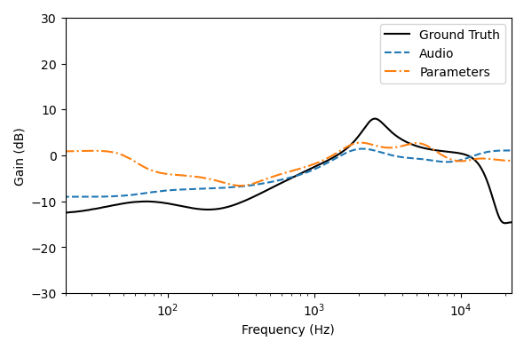

# Work in progress

# Blind estimation of audio effects using an auto-encoder approach and differentiable signal processing

Github repository for the paper submitted to ICASSP 2024 : Blind estimation of audio effects using an auto-encoder approach and differentiable signal processing

```
This Github repo is still work in progress.
```


Audio examples can be found on the [project's Github Page](https://peladeaucome.github.io/ICASSP-2024-BEAFX-using-DDSP/)

## How to use

Works in `Python 3.10.9`.

- Install `requirements.txt` (`pip install -r requirements.txt`)
- Run `python train_analysis_net.py` with wanted options

### Options List

The options to choose the synthesis FX $\{e^s\}$, the analysis AFX $\{e^a\}$, the analysis net $f^a$ and the loss function.

#### Synthesis AFX

Use option `--sfx=sfx1_sfx2_..`. If multiple FX are used, they will be in the following order, regardless of the keys order : equalizer $\to$ compressor $\to$ clipper.

| Effect Class   | Effect implementation| Key        |
|----------------|----------------------|------------|
| **Equalizer**  | Graphic equalizer    | `geq`      | 
|                | Parametric equalizer | `peq`      | 
| **Compressor** | DSP Compressor       | `compfull` |
|                | DSP Compressor       | `comphalf` |
| **Distortion** | Parametric clipper   | `dist`     |

There are two keys for the DSP compressor because the code needs the `sfx` and `afx` options to be the same to use the `params` loss.

#### Analysis AFX

Use option `--afx=afx1_afx2_..`. If multiple FX are used, they will be in the following order, regardless of the keys order : equalizer $\to$ compressor $\to$ clipper.

| Effect Class   | Effect implementation      | Key         |
|----------------|----------------------------|-------------|
| **Equalizer**  | Graphic equalizer          | `geq`       | 
|                | Parametric equalizer       | `peq`       | 
| **Compressor** | Neural Proxy               | `compfull`  |
|                | Hybrid Neural Proxy        | `comphalf`  |
|                | Simplifide DSP Compressor  | `compsimple`|
| **Distortion** | Parametric clipper         | `dist`      |
|                | Taylor distortion model    | `taylor`    |
|                | Chebyshev distortion model | `chebyshev` |

#### Analysis Network Encoder

Use option `--encoder=key`.

| Encoder                       | Key              |
|-------------------------------|------------------|
| Timbre Encoder (TE)           | `multitimbre_cqt`| 
| Time-Frequency Encoder (TFE)  | `time_frequency` | 
| Musical Effects Encoder (MEE) | `mee`            |

#### Loss Functions

Use option `--loss=key`

| Loss                                                                        | Key      |
|-----------------------------------------------------------------------------|----------|
| Audio Mel-Spectrogram $\mathcal{L}_\text{Mel}(\hat{\mathbf{y}},\mathbf{y})$ | `mel`    | 
| Parameters $\text{MSE}(\hat{\mathbf{q}},\mathbf{q})$                        | `params` | 

## Some results
### EQ matching

On the figure below, the both synthesis and analysis EQs are parametric.
The blue curve is the equalization curve estimated by a network trained with our approach.
The orange curve is estimated by a network trained to minimize parameter distance.

In this example, the orange curve is actually closer to the ground truth than the blue in terms of parameter distance $\text{MSE}(\hat{\mathbf{q}},\mathbf{q})$ despite being further in terms of audio distance.



